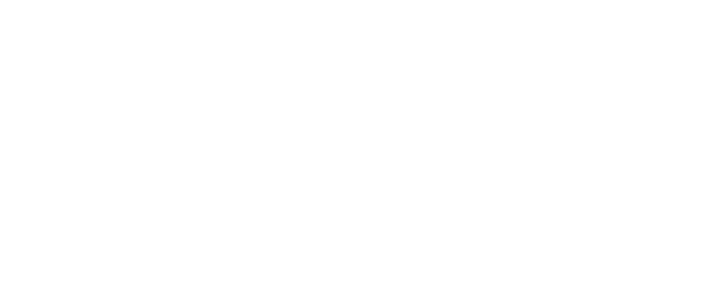
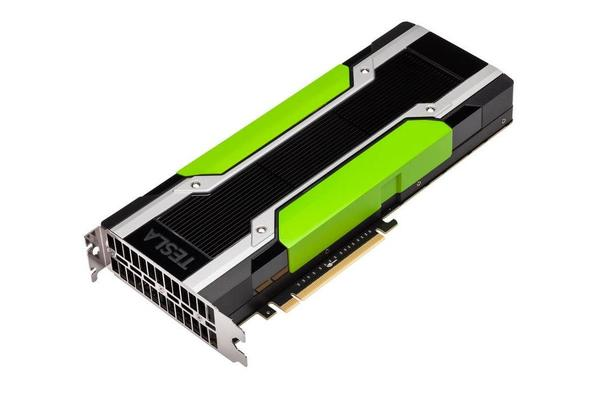
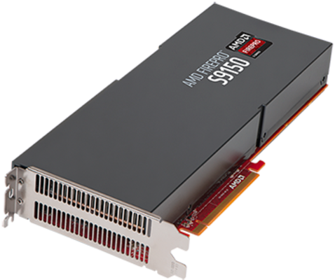
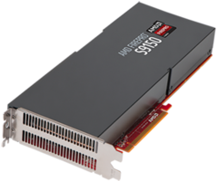
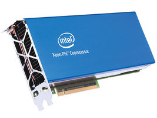
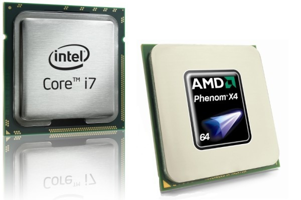

# Disclaimer(s)


## No OpenGL/Vulkan here!

[columns,class="row vertical-align"]

[column,class="col-xs-6"]



[/column]

[column,class="col-xs-6"]


[/column]

[/columns]

<center>
&copy; [Khronos Group](https://www.khronos.org/news/logos/)
</center>

## This is Open-Source!

<center>
Feel free to reply, discuss, inform, correct, ...   

**[github.com/psteinb/meetingcpp2015](https://github.com/psteinb/meetingcpp2015)**
</center>

. . .  

<center>
If not stated otherwise, the slides and all it's code is licensed under

__Creative Commons Attribution 4.0 International License__ ([CC-BY 4.0](http://creativecommons.org/licenses/by/4.0/))
</center>


## Outline

<center>
1. Massively Parallel Programming

2. Architecture

3. What can you use today

4. What can you use tomorrow
</center>


# Massively Parallel Programming

## Why all the fuzz??


<center>
  
Data obtained from [Top500.org](www.Top500.org)
</center>

## Vendor Options

<!-- TODO: image origins -->
[columns,class="row vertical-align"]

[column,class="col-xs-4"]

<center>
Nvidia Tesla  


GPU without Graphics
</center>

[/column]

[column,class="col-xs-4"]

<center>
AMD FirePro  


GPU without Graphics
</center>

[/column]

[column,class="col-xs-4"]

<center>
Intel MIC  


Not Covered Today!
</center>

[/column]

[/columns]


## Vendor flag ships

<!-- TODO: image origins -->
[columns,class="row vertical-align"]

[column,class="col-xs-4"]

<center>
_Nvidia Tesla K80_ 

</center>

[/column]

[column,class="col-xs-4"]

<center>
_AMD FirePro S9170_

</center>

[/column]

[column,class="col-xs-4"]

<center>
Intel Xeon Phi 5110P

</center>

[/column]

[/columns]


[columns,class="row vertical-align"]

[column,class="col-xs-4"]

* 2x GK210 chipsets
* 2x 12 GB GDDR5 RAM
* 2x 288 GB/s to RAM
* 8.7 TFlops SP
* 2.9 TFlops DP

[/column]

[column,class="col-xs-4"]

* 1x Grenada XT
* 32 GB GDDR5 RAM
* 320 GB/s to RAM
* 5.2 TFlops SP
* 2.6 TFlops DP

[/column]

[column,class="col-xs-4"]

* 62x x86 CPUs
* 8 GB GDDR5 RAM
* 320 GB/s to RAM
* 2.1 TFlops SP
* 1.1 TFlops DP

[/column]

[/columns]

<!-- http://www.theregister.co.uk/2012/05/18/inside_nvidia_kepler2_gk110_gpu_tesla/ -->
# Architecture { data-background="img/nvidia_kepler_die_shot.jpg"} 


## { data-background="img/1200x_islay_overbright.png" data-background-size="1200px" }


## { data-background="img/1200x_islay_overbright_annotated.png" data-background-size="1200px" }


## Food Hunt

[columns,class="row vertical-align"]

[column,class="col-xs-6"]

<!-- https://commons.wikimedia.org/wiki/File:Thunnus_orientalis_(Osaka_Kaiyukan_Aquarium).jpg -->
<center>
Tuna  
  
(fast, single, versatile)
</center>

[/column]


[column,class="col-xs-6"]

<!-- https://commons.wikimedia.org/wiki/File:School_of_Pterocaesio_chrysozona_in_Papua_New_Guinea_1.jpg -->
<center>
Forage Fish  
  
(small, many, use wakefield of neighbor)
</center>

[/column]

[/columns]


## The same principle on die

[columns,class="row vertical-align"]

[column,class="col-xs-6"]

<!-- TODO -->
<center>
CPU  

</center>

[/column]

[column,class="col-xs-6"]

<!-- TODO -->
<center>
GPU  

</center>

[/column]

[/columns]

<center>
Note: Will use Nvidia Kepler as example without loss of generality for GPGPU.
</center>

## A more in-depth look

<div style="text-align: center;margin-top: 4%;">
<object type="image/svg+xml" data="figures/K40.svg"
width="1400" border="0" style="background-color: #FFFFFF;">
</object>
</div>

<center>
Nvidia K40: 15 Streaming Multiprocessors (SMX), 12 GB of GDDR5 DRAM
</center>

## Kepler SMX Close-up

<div style="text-align: center;margin-top: 4%;">
<object type="image/svg+xml" data="figures/GK210_sm.svg"
width="1600" border="0" style="background-color: #FFFFFF;">
</object>
</div>

<center>
CUDA core: 1 fp32 ops / clock <!-- (1/3 fp64 ops / clock) -->
</center>


## SIMT Execution

[columns,class="row vertical-align"]

[column,class="col-xs-2"]

**Warp**

[/column]


[column,class="col-xs-4"]


<object type="image/svg+xml" data="figures/thread.svg"
height="200" border="0">
</object>


[/column]

[column,class="col-xs-8"]

* smallest unit of concurrency: *32 threads*
* thread = single CUDA core
* all threads execute same program

[/column]

[/columns]

. . .  

[columns,class="row vertical-align"]

[column,class="col-xs-2"]

**Block**

[/column]


[column,class="col-xs-4"]


<object type="image/svg+xml" data="figures/thread_block.svg"
height="200" border="0" >
</object>


[/column]

[column,class="col-xs-8"]

* can synchronize (barriers)
* can exchange data (common "shared" memory, etc.)

[/column]

[/columns]


. . .  

[columns,class="row vertical-align"]

[column,class="col-xs-2"]

**Grid**

[/column]


[column,class="col-xs-4"]


<object type="image/svg+xml" data="figures/grid_block.svg"
height="200" border="0" >
</object>


[/column]

[column,class="col-xs-8"]

* grids/blocks serve as work distribution/sharing mechanism on device (occupancy)

[/column]

[/columns]


## Hiding Memory Latency

* grid blocks dispatched to SMX based warp schedulers  

. . .

&nbsp;

[columns,class="row vertical-align"]

[column,class="col-xs-12"]

<center>
<object type="image/svg+xml" data="figures/high_throughput_smx.svg"
width="1400" border="0" >
</object>
</center>

[/column]

[/columns]


&nbsp;


* hide (memory) latency by interleaving active warps


## Note: Data Locality

<center>
[columns,class="row vertical-align"]

[column,class="col-xs-12"]

<object type="image/svg+xml" data="figures/gpu_cpu_dichotomy.svg"
width="1400" border="0" >
</object>


[/column]

[/columns]

**Keep data put as long as possible!**

</center>

## Note: Memory Access

<center>
**Good: Coalesced Memory Access**

[columns,class="row vertical-align"]

[column,class="col-xs-12"]

<object type="image/svg+xml" data="figures/coalesced_mem_access.svg"
width="1000" border="0" >
</object>


[/column]

[/columns]

</center>


. . .

<center>

**Bad: Non-Coalesced Memory Access**

[columns,class="row vertical-align"]

[column,class="col-xs-12"]

<object type="image/svg+xml" data="figures/non_coalesced_mem_access.svg"
width="1000" border="0" >
</object>

* every thread accesses different cache line at random
* warp has to be replayed 31 times to complete 1 instruction

[/column]

[/columns]

</center>


## Summary Architecture

<center>
* **GPUs are complicated beasts**

* **massive parallel compute power** 

* **massive ways to kill performance**
</center>

# What can you use today?

## A Word of Warning!

[columns,class="row vertical-align"]

[column,class="col-xs-6"]

<!-- https://pixabay.com/p-42657/?no_redirect -->


[/column]

[column,class="col-xs-6"]

<center>
**Never ever program GPGPUs!**  
</center>

. . .


* 32 threads is the minimum you get

* good tools are rare and almost never portable

. . .

<center>
**Use a Library!**

</center>

[/column]

[/columns]


## Use Libraries!

[columns,class="row"]

[column,class="col-xs-6"]

<center>
**Vendor sponsored**
</center>

[/column]

[column,class="col-xs-6"]

<center>
**Open Source**
</center>

[/column]

[/columns]


[columns,class="row"]

[column,class="col-xs-3 text-right"]

<center>
[CUDA](https://developer.nvidia.com/gpu-accelerated-libraries) based  

* cuBLAS
* cuFFT
* cuDNN
* cuSparse
* cuSolver
* cuRAND  
...

</center>

[/column]


[column,class="col-xs-3"]

<center>
[OpenCL](http://developer.amd.com/tools-and-sdks/opencl-zone/acl-amd-compute-libraries/) based  

* clBLAS
* clFFT
* clSparse
* clRNG  
...

</center>


[/column]

[column,class="col-xs-6"]

<center>
* Linear Algrebra:  
[VexCL](https://github.com/ddemidov/vexcl), [ViennaCL](http://viennacl.sourceforge.net/), ...

* Image/Video Processing:  
[OpenCV](http://opencv.org/), [Ffmpeg](http://ffmpeg.org/), ...

* Machine Learning:  
  [Caffe](http://caffe.berkeleyvision.org/), [Torch](http://torch.ch/), ...

* Bioinformatics:  
[SeqAn](http://www.seqan.de/), [nvbio](https://github.com/NVlabs/nvbio), ...

</center>

[/column]

[/columns]

## CUDA Overview

[columns,class="row vertical-align"]

[column,class="col-xs-8"]

<center>
**C**ompute **U**nified **D**evice **A**rchitecture  
([Nvidia CUDA Zone](https://developer.nvidia.com/cuda-zone))
</center>

[/column]

[column,class="col-xs-4"]

<center>

</center>

[/column]

[/columns]

<center>
* freeware tool suite, gpu library package and low/high level API(s)

* CUDA platform supports C, C++ and Fortran

* binaries run on Nvidia hardware only

* source code split into host and device part

		* host: C++11 and STL supported

		* device: subset of C++11
		  (no exceptions, no iostream, no inheritance support, no STL)

</center>


## CUDA Vector Sum

&nbsp;

<center>
```a[i] = b[i] + d*a[i]```
</center>

. . . 


&nbsp;

<center>
**[Simple 5 Steps](http://devblogs.nvidia.com/parallelforall/easy-introduction-cuda-c-and-c/)**  
</center>

<center>
1. Declare and allocate host and device memory.
1. Initialize host data.
1. Transfer data from the host to the device.
1. Execute one or more kernels (vector sum).
1. Transfer results from the device to the host.  
</center>


## CUDA Code

~~~~ {.cpp}
int main(void)
{
  std::size_t vsize = (1<<20);

  //..

  std::vector<float> host_a(vsize,1.f);
  std::vector<float> host_b(vsize,2.f);
  const float host_d = 42.f;

  //gpu relevant code
  float * device_a=nullptr, *device_b=nullptr;

  const std::size_t vsize_byte=vsize*sizeof(float);

  //allocate memory
  cudaMalloc(&device_a, vsize_byte); 
  cudaMalloc(&device_b, vsize_byte);

  //transfer memory
  cudaMemcpy(device_a, &host_a[0], vsize_byte,
             cudaMemcpyHostToDevice);
  cudaMemcpy(device_b, &host_b[0], vsize_byte,
			 cudaMemcpyHostToDevice);

  //dispatch to device
  vector_sum<<<(vsize+255)/256, 256>>>(vsize,
					     host_d,
					     device_a,
					     device_b);

  //transfer memory back
  cudaMemcpy(&host_a[0], device_a, vsize_byte,
             cudaMemcpyDeviceToHost);

  //...

  cudaFree(device_a);
  cudaFree(device_b);
  return 0;
}

//above main
__global__ void vector_sum(std::size_t _size,
			   float _scale,
			   float* _a,
			   float* _b){
  std::size_t index = blockIdx.x*blockDim.x + threadIdx.x;
  if (index < _size)
    _a[index] = _scale*_a[index] + _b[index];
}
~~~~~~~~~~~~~~~~~~~~~~~~~~~~~~~~~~~~~~~~~~~~~~~~~~~~~~~~~~~~~~~~

## CUDA Wrap-up

[columns,class="row"]

[column,class="col-xs-6 text-success"]

<center>

* _free and working_

* CUDA comes with a _ton of tools_  
(debugger, profiler, libraries, ...)

* CUDA comes with a _ton of examples_ 

* very _flexible_ (device instrinsics, locked memory handling, ...)

* *nVidia very active* in porting scientific applications

* *nVidia very active* C++ standardisation (Parallelism TS)

</center>

[/column]

. . . 

[column,class="col-xs-6 text-warning"]

<center>

* plain C API  
(memory allocation, error handling, asynchronous calls, ...)

* grid dispatch is error prone  
(code repetition in index calculation)

* compiler is sometimes hard to come by (using boost, OpenMP interoperability)

* ```__keyword__``` disrupt good design (maintainability)

</center>

[/column]

[/columns]


## OpenCL

[columns,class="row vertical-align"]

[column,class="col-xs-6"]

<center>
**Open C**ompute **L**anguage  
([khronos.org/opencl](https://www.khronos.org/opencl/))
</center>

[/column]

[column,class="col-xs-4 bg-primary"]

<center>
_No Logo due to Apple's Copyright_
</center>

[/column]

[/columns]

&nbsp;

<center>
* open, royalty-free standard for cross-platform, parallel programming

* designed to run on CPUs, GPUs, FPGAs, DSPs, ...

* maintained by non-profit technology consortium Khronos Group

* source code split into host and device part

		* device: C99 derived language

		* host: C/C++ based API for management, transfers, error handling, ...
</center>

## OpenCL Kernel

~~~~ {.cpp}
const char *kernelSource =                     "\n" \
"__kernel void vecAdd(  __global float *a,      \n" \
"                       __global float *b,      \n" \
"                       __global float *c,      \n" \
"                       const unsigned int n)   \n" \
"{                                              \n" \
"    int id = get_global_id(0);                 \n" \
"                                               \n" \
"    //Make sure we do not go out of bounds     \n" \
"    if (id < n)                                \n" \
"        c[id] = a[id] + b[id];                 \n" \
"}                                              \n" \
                                               "\n" ;
~~~~
<center>
from [www.olcf.ornl.gov](https://www.olcf.ornl.gov/tutorials/opencl-vector-addition/)
</center>

## thrust

[columns,class="row vertical-align"]

[column,class="col-xs-6"]

<center>
_parallel algorithms library which resembles the C++ Standard Template Library (STL)_
</center>

[/column]

[column,class="col-xs-4"]

<center>
  
[thrust.github.io](http://thrust.github.io/)
</center>

[/column]

[/columns]

&nbsp;

<center>
* open source (Apache v2 license)

* interoperability with CUDA, TBB and OpenMP (possible backends)

* high level interface compared to CUDA/OpenCL
</center>


## thrust Vector ADD

~~~ {.cpp}
struct saxpy_functor : public thrust::binary_function<float,float,float>
{
    const float a;

    saxpy_functor(float _a) : a(_a) {}

	__host__ __device__
        float operator()(const float& x, const float& y) const { 
            return a * x + y;
        }
};

int main(//...){

  thrust::host_vector<float> host_a(N,1.f);
  thrust::host_vector<float> host_b(N,2.f);
  const float scale = 42.f;

  thrust::device_vector<float> dev_a = host_a;
  thrust::device_vector<float> dev_b = host_b;

  thrust::transform(dev_a.begin(), dev_a.end(),  // input range #1
		    dev_b.begin(),           // input range #2
		    dev_a.begin(),           // output range
		    saxpy_functor(scale));        

  //thrust::transform(thrust::omp::par,
				dev_a.begin(), dev_a.end(),  // input range #1
				dev_b.begin(),           // input range #2
				dev_a.begin(),           // output range
				saxpy_functor(scale));        
  	
}
~~~

## thrust Wrap-up

[columns,class="row"]

[column,class="col-xs-6 text-success"]

<center>
* C++ and STL for GPUs

* container and algorithm API well thought through 

* code becomes readable (for a C++Dev)

* algorithms can be dispatched from device kernels as well

* many examples, active community
</center>

[/column]

. . . 

[column,class="col-xs-6 text-warning"]

<center>
* loss of flexibility  
(pinned host vectors considered experimental)

* index information lost during functor invocation

* exploiting device memory hierarchy remains manual work 

* C++11, C++17 ?
</center>

[/column]

[/columns]


## C++AMP and HC


## Pragma Mafia

# What can you use tomorrow

## Boost.Compute

## Sycle and Spear

## C++17


# Summary

## Image References


# Backup


