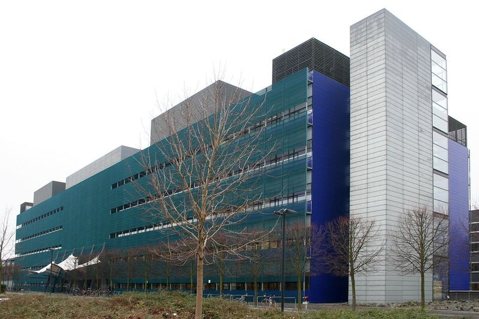
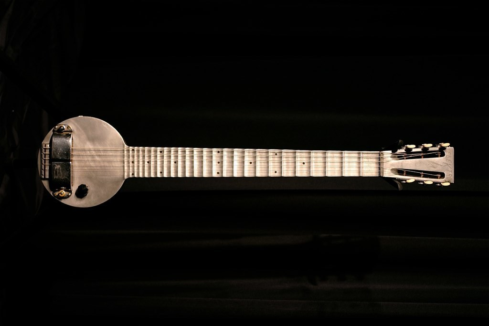
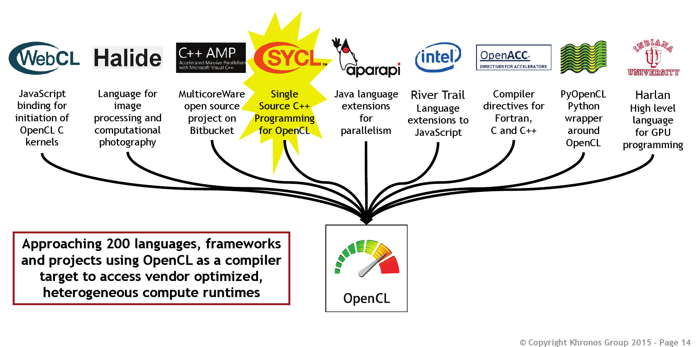

# Disclaimer(s)


## No OpenGL/Vulkan here!

[columns,class="row vertical-align"]

[column,class="col-xs-6"]


[/column]

[column,class="col-xs-6"]


[/column]

[/columns]

<center>
&copy; [Khronos Group](https://www.khronos.org/news/logos/)
</center>

## This is Open-Source!

<center>
Feel free to reply, discuss, inform, correct, ...   

**[github.com/psteinb/meetingcpp2015](https://github.com/psteinb/meetingcpp2015)**
</center>

. . .  

&nbsp;

<center>
If not stated otherwise, the slides and all it's code are licensed under

**[Creative Commons Attribution 4.0 International License](http://creativecommons.org/licenses/by/4.0/)**
</center>

## Who am I?

[columns,class="row vertical-align"]

[column,class="col-xs-8"]

<center>
  
*Scientific Software Engineer* at Max Planck Institute of Molecular Cell Biology and Genetics
</center>

[/column]

[column,class="col-xs-4"]

* Dresden, Saxony
* 450 staff
* founded 2001
* cell biology
* genomics
* systems biology

[/column]

[/columns]

## What do I do?

<center>

<video width="1400" poster="video/Celegans_lateral_one_view_versus_deconvolved.png" controls loop>
<source src="video/Celegans_lateral_one_view_versus_deconvolved.webm" type='video/webm; codecs="vp8.0, vorbis"'>
<source src="video/Celegans_lateral_one_view_versus_deconvolved.mp4" type='video/mp4'>
<p>Movie does not work! Sorry!</p>
</video>


*Accelerating [scientific algorithms](http://www.nature.com/nmeth/journal/v11/n6/full/nmeth.2929.html) on [GPUs](https://github.com/psteinb/gtc2015.git)
(multi-GB dataset, a lot of FFTs)*

</center>

## Outline

<div style="font-size : 1.5em">

<center>
1. Massively Parallel Programming

2. Architecture

3. What can you use today

4. What can you use tomorrow
</center>

</div>

# Massively Parallel Programming { data-background="img/Titan_render.png" data-background-size="800px" style="margin-top: 20%"} 

## Yet Another Hype?

<center>

<object type="image/svg+xml" data="data/201x_acc_fraction.svg"
width="1300" border="0" style="background-color: #FFFFFF;">
</object>  

Data obtained from [Top500.org](www.Top500.org)

</center>

## Vendor Options

<!-- TODO: image origins -->
[columns,class="row"]

[column,class="col-xs-4"]

<center>
Nvidia Tesla  


GPU without Graphics
</center>

[/column]

[column,class="col-xs-4"]

<center>
AMD FirePro  


GPU without Graphics
</center>

[/column]

[column,class="col-xs-4"]

<center>
Intel MIC  


Not Covered Today!
</center>

[/column]

[/columns]


## Vendor flag ships

<!-- TODO: image origins -->
[columns,class="row vertical-align"]

[column,class="col-xs-4"]

<center>
_Nvidia Tesla K80_ 

</center>

[/column]

[column,class="col-xs-4"]

<center>
_AMD FirePro S9170_

</center>

[/column]

[column,class="col-xs-4"]

<center>
Intel Xeon Phi 5110P

</center>

[/column]

[/columns]

&nbsp;

[columns,class="row vertical-align"]

[column,class="col-xs-4"]

<center>
* 2x GK210 chipsets
* 2x 12 GB GDDR5
* 2x 288 GB/s to RAM
* 8.7 TFlops SP
* 2.9 TFlops DP
</center>

[/column]

[column,class="col-xs-4"]

<center>
* 1x Grenada XT
* 32 GB GDDR5 RAM
* 320 GB/s to RAM
* 5.2 TFlops SP
* 2.6 TFlops DP
</center>

[/column]

[column,class="col-xs-4"]

<center>
* 62x x86 CPUs
* 8 GB GDDR5 RAM
* 320 GB/s to RAM
* 2.1 TFlops SP
* 1.1 TFlops DP
</center>

[/column]

[/columns]

<!-- http://www.theregister.co.uk/2012/05/18/inside_nvidia_kepler2_gk110_gpu_tesla/ -->
# Architecture { data-background="img/nvidia_kepler_die_shot.jpg" } 


## { data-background="img/islay_1024px.png" data-background-size="800px" }


## { data-background="img/islay_annotated_1024px.png" data-background-size="800px" }


## Food Hunt

[columns,class="row vertical-align"]

[column,class="col-xs-6"]

<!-- https://commons.wikimedia.org/wiki/File:Thunnus_orientalis_(Osaka_Kaiyukan_Aquarium).jpg -->
<center>
Tuna  
  
(fast, single, versatile)
</center>

[/column]


[column,class="col-xs-6"]

<!-- https://commons.wikimedia.org/wiki/File:School_of_Pterocaesio_chrysozona_in_Papua_New_Guinea_1.jpg -->
<center>
Forage Fish  
  
(small, many, use wakefield of neighbor)
</center>

[/column]

[/columns]


## The same principle on die

[columns,class="row vertical-align"]

[column,class="col-xs-6"]

<!-- TODO -->
<center>
CPU  

</center>

[/column]

[column,class="col-xs-6"]

<!-- TODO -->
<center>
GPU  

</center>

[/column]

[/columns]

<center>
Note: Will use Nvidia Kepler as GPGPU example.
</center>

## A more in-depth look

<center>
<object type="image/svg+xml" data="figures/K40.svg"
width="1400" border="0" style="background-color: #FFFFFF;">
</object>
</center>

<center>
Nvidia K40: 15 Streaming Multiprocessors (SMX), 12 GB of GDDR5 DRAM
</center>

## Kepler SMX Close-up

<div style="text-align: center;margin-top: 4%;">
<object type="image/svg+xml" data="figures/GK210_sm.svg"
width="1600" border="0" style="background-color: #FFFFFF;">
</object>
</div>

<center>
CUDA core: 192 fp32 ops / clock <!-- (1/3 fp64 ops / clock) -->
</center>


## SIMT Execution

[columns,class="row vertical-align"]

[column,class="col-xs-2"]

**Warp**

[/column]


[column,class="col-xs-4"]


<object type="image/svg+xml" data="figures/thread.svg"
height="200" border="0">
</object>


[/column]

[column,class="col-xs-8"]

* smallest unit of concurrency: *32 threads*
* thread = single CUDA core
* all threads execute same program

[/column]

[/columns]

. . .  

[columns,class="row vertical-align"]

[column,class="col-xs-2"]

**Block**

[/column]


[column,class="col-xs-4"]


<object type="image/svg+xml" data="figures/thread_block.svg"
height="200" border="0" class="img-rounded">
</object>


[/column]

[column,class="col-xs-8"]

* can synchronize (barriers)
* can exchange data (common "shared" memory, etc.)

[/column]

[/columns]


. . .  

[columns,class="row vertical-align"]

[column,class="col-xs-2"]

**Grid**

[/column]


[column,class="col-xs-4"]


<object type="image/svg+xml" data="figures/grid_block.svg"
height="200" border="0" class="img-rounded">
</object>


[/column]

[column,class="col-xs-8"]

* grids/blocks serve as work distribution/sharing mechanism on device (occupancy)
* blocks dispatched to SMX (in turn run warps)

[/column]

[/columns]


## Hiding Memory Latency

* [Kepler](http://docs.nvidia.com/cuda/cuda-c-programming-guide/index.html#multiprocessor-level):

	* global memory access: 200-400 ticks per warp

	* fp32 add/mul/fma: 32 per tick per warp

. . .

&nbsp;

[columns,class="row vertical-align"]

[column,class="col-xs-12"]

<center>
<object type="image/svg+xml" data="figures/high_throughput_smx.svg"
width="1400" border="0" class="img-rounded">
</object>
</center>

[/column]

[/columns]

* hide (memory) latency by pipelining active warps


#  { data-background="img/1024px-unmarked_holes.jpg" }

## Compute > Memory Access

<center>
<object type="image/svg+xml" data="figures/high_throughput_smx.svg"
width="1400" border="0" class="img-rounded">
</object>

&nbsp;

* device kernels

    * arithmetic complexity needs to be high 

    * number of arithmetic operations > number of load/store operations

</center>


## Data Locality

<center>
[columns,class="row vertical-align"]

[column,class="col-xs-12"]

<object type="image/svg+xml" data="figures/gpu_cpu_dichotomy.svg"
width="1400" border="0" class="img-rounded">
</object>


[/column]

[/columns]

**Keep data put as long as possible!**

</center>

## Memory Access

<center>

**Bad: Non-Coalesced Memory Access**

[columns,class="row vertical-align"]

[column,class="col-xs-12"]

<object type="image/svg+xml" data="figures/non_coalesced_mem_access.svg"
width="1200" border="0" class="img-rounded">
</object>

* every thread accesses different cache line at random
* warp has to be replayed 31 times to complete 1 instruction

[/column]

[/columns]

</center>


. . .


<center>
**Good: Coalesced Memory Access**

[columns,class="row vertical-align"]

[column,class="col-xs-12"]


<object type="image/svg+xml" data="figures/coalesced_mem_access.svg"
width="1200" border="0" class="img-rounded">
</object>


[/column]

[/columns]

</center>


## Summary Architecture

<center>
* **GPUs are complicated beasts**

* **massive parallel compute power** (per Watt) 

* **massive ways to kill performance**
</center>

<!-- https://commons.wikimedia.org/wiki/File:Colorful_Guitars,_Haight_Street,_San_Francisco.jpg -->

# What can you use today? { data-background="img/1024px-San_Francisco_Haight_Str_Guitar_Shop.jpg" style="color: black; margin: 0;margin-top: -100px;" }

## A Word of Warning!

[columns,class="row vertical-align"]

[column,class="col-xs-6"]

<center>
<!-- https://pixabay.com/p-42657/?no_redirect -->

</center>

[/column]

[column,class="col-xs-6"]

<div style="font-size: 1.5em">
<center>
* 32 threads is the minimum

* good tools are rare and almost never portable
<center>

. . .

<center>
**Use a Library!**

</center>
</div>

[/column]

[/columns]


## Use Libraries!

[columns,class="row"]

[column,class="col-xs-6"]

<center>
**Vendor sponsored**
</center>

[/column]

[column,class="col-xs-6"]

<center>
**Open Source**
</center>

[/column]

[/columns]


[columns,class="row"]

[column,class="col-xs-3 text-right"]

<center>
[CUDA](https://developer.nvidia.com/gpu-accelerated-libraries) based  

* cuBLAS
* cuFFT
* cuDNN
* cuSparse
* cuSolver
* cuRAND  
...

</center>

[/column]


[column,class="col-xs-3"]

<center>
[OpenCL](http://developer.amd.com/tools-and-sdks/opencl-zone/acl-amd-compute-libraries/) based  

* clBLAS
* clFFT
* clSparse
* clRNG  
...

</center>


[/column]

[column,class="col-xs-6"]

<center>
* Multi-Purpose:  
[Alpaka](https://github.com/ComputationalRadiationPhysics/alpaka), [ArrayFire](https://github.com/arrayfire/arrayfire),   
[VexCL](https://github.com/ddemidov/vexcl), [ViennaCL](http://viennacl.sourceforge.net/), ...

* Image/Video Processing:  
[OpenCV](http://opencv.org/), [Ffmpeg](http://ffmpeg.org/), ...

* Machine Learning:  
  [Caffe](http://caffe.berkeleyvision.org/), [Torch](http://torch.ch/), ...

* Bioinformatics:  
[SeqAn](http://www.seqan.de/), [nvbio](https://github.com/NVlabs/nvbio), ...

</center>

[/column]

[/columns]


## Baseline Example

<center>
```
void vector_sum(std::vector<float>& a,
				float scale, const std::vector<float>& b) {
	for (int i=0; i<a.size(); i++) 
		a[i] = a[i] * scale + b[i];
}
```
**Vector Sum**
</center>


## CUDA Overview

[columns,class="row vertical-align"]

[column,class="col-xs-8"]

<center>
**C**ompute **U**nified **D**evice **A**rchitecture  
([Nvidia CUDA Zone](https://developer.nvidia.com/cuda-zone))
</center>

[/column]

[column,class="col-xs-4"]

<center>

</center>

[/column]

[/columns]

<center>
* freeware tool suite, gpu library package and low/high level API(s)

* CUDA platform supports C and C++ with proprietary compiler 

* binaries run on Nvidia hardware only

* source code split into host and device part

    * host  : C++11 and STL supported
    
    * device: tiny subset of C++11  
	(no exceptions, no iostream, no virtual inheritance, no STL)

</center>


## [5 Simple Steps In CUDA](http://devblogs.nvidia.com/parallelforall/easy-introduction-cuda-c-and-c/)

&nbsp;

<div style="font-size: 1.5em">
<center>
1. Declare and allocate host and device memory.
1. Initialize host data.
1. Transfer data from the host to the device.
1. Execute one or more kernels (vector sum).
1. Transfer results from the device to the host.  
</center>
</div>

## CUDA Code: Mem Init

~~~~ {.cpp}
int main(/*..*/){//..
  std::vector<float> host_a(vsize,1.f);
  std::vector<float> host_b(vsize,2.f);

  float * device_a=nullptr, *device_b=nullptr;
  cudaMalloc(&device_a, vsize_byte); 
  cudaMalloc(&device_b, vsize_byte);

  cudaMemcpy(device_a, &host_a[0], vsize_byte,
             cudaMemcpyHostToDevice);
  cudaMemcpy(device_b, &host_b[0], vsize_byte,
			 cudaMemcpyHostToDevice);
~~~~
  
## CUDA Code: Compute

~~~~ {.cpp}
//above main
__global__ void vector_sum(std::size_t _size,
			   float _scale, float* _a, float* _b){
  std::size_t index = blockIdx.x*blockDim.x + threadIdx.x;
  if (index < _size)
    _a[index] = _scale*_a[index] + _b[index];
}

//in main: dispatch to device
vector_sum<<<(vsize+255)/256, 256>>>(vsize,
									 host_d,
									 device_a,
									 device_b);
~~~~~

## CUDA Code: Mem TX + Clean-up

~~~~ {.cpp}
  //transfer memory back
  cudaMemcpy(&host_a[0], device_a, vsize_byte,
             cudaMemcpyDeviceToHost);

  //clean-up
  cudaFree(device_a);
  cudaFree(device_b);
  return 0;
}

~~~~~

## CUDA Wrap-up

[columns,class="row"]

[column,class="col-xs-6 text-success"]

<center>

* _free and working_

* CUDA comes with a _ton of tools_  
(debugger, profiler, libraries, ...)

* CUDA comes with a _ton of examples_ 

* very _flexible_ (device instrinsics, locked memory handling, ...)

* *nVidia very active* in porting scientific applications

* *nVidia very active* C++ standardisation (Parallelism TS)

</center>

[/column]

. . . 

[column,class="col-xs-6 text-warning"]

<center>

* plain C API  
(memory allocation, error handling, asynchronous calls, ...)

* grid dispatch is error prone  
(code repetition in index calculation)

* compiler is sometimes hard to come by (using boost, OpenMP interoperability)

* ```__keyword__``` disrupt design (redundancy, maintainability)

</center>

[/column]

[/columns]

## CUDA is like ... { data-background="img/1024px-Taylor415_acoustic.jpg" }

## OpenCL

[columns,class="row vertical-align"]

[column,class="col-xs-6"]

<center>
**Open C**ompute **L**anguage  
([khronos.org/opencl](https://www.khronos.org/opencl/))
</center>

[/column]

[column,class="col-xs-4 bg-primary"]

<center>
_No Logo due to Apple's Copyright_
</center>

[/column]

[/columns]

&nbsp;

<center>
* open, royalty-free standard for cross-platform, parallel programming

* designed to run on CPUs, GPUs, FPGAs, DSPs, ...

* maintained by non-profit technology consortium Khronos Group

* source code split into host and device part

    * host  : C/C++ based API (lower level than CUDA)

    * device: C11 derived language ([OpenCL 2.0](https://www.khronos.org/registry/cl/sdk/2.0/docs/OpenCL-2.0-refcard.pdf))


</center>

## OpenCL Kernel

~~~~ {.cpp}
const char *kernelSource =                     "\n" \
"__kernel void vecAdd(  __global float *a,      \n" \
"                       __global float *b,      \n" \
"                       __global float *c,      \n" \
"                       const unsigned int n)   \n" \
"{                                              \n" \
"    int id = get_global_id(0);                 \n" \
"                                               \n" \
"    //Make sure we do not go out of bounds     \n" \
"    if (id < n)                                \n" \
"        c[id] = a[id] + b[id];                 \n" \
"}                                              \n" \
                                               "\n" ;
~~~~
<center>
from [www.olcf.ornl.gov](https://www.olcf.ornl.gov/tutorials/opencl-vector-addition/)
</center>

## OpenCL is like ... 

<center>
](img/Andy_McKee_January_2008.jpg)
</center>

## thrust

[columns,class="row vertical-align"]

[column,class="col-xs-6"]

<center>
_parallel algorithms library which resembles the C++ Standard Template Library (STL)_
</center>

[/column]

[column,class="col-xs-4"]

<center>
  
[thrust.github.io](http://thrust.github.io/)
</center>

[/column]

[/columns]

&nbsp;

<center>
* open source (Apache v2 license)

* interoperability with CUDA, TBB and OpenMP (possible backends)

* high level interface compared to CUDA/OpenCL
</center>


## thrust Code: Functor 

~~~ {.cpp}
struct saxpy_functor :
public thrust::binary_function<float,float,float>
{
    const float a;
    saxpy_functor(float _a) : a(_a) {}

	__host__ __device__
    float operator()(const float& x,
					 const float& y
					) const { 
            return a * x + y;
        }
};
~~~~~

## thrust Code: GPU dispatch

~~~ {.cpp}
int main(//...){//..

  thrust::host_vector<float> host_a(N,1.f);
  thrust::host_vector<float> host_b(N,2.f);

  thrust::device_vector<float> dev_a = host_a;
  thrust::device_vector<float> dev_b = host_b;

  thrust::transform(dev_a.begin(),dev_a.end(), 
					dev_b.begin(),
				    dev_a.begin(),
				    saxpy_functor(scale));	
}
~~~

## thrust Wrap-up

[columns,class="row"]

[column,class="col-xs-6 text-success"]

<center>
* C++ and STL for GPUs (and CPUs)!

* container and algorithm API well thought through 

* code becomes readable/maintainable (at least for a C++Dev)

* algorithms can be dispatched from device kernels as well

* many examples, active community
</center>

[/column]

. . . 

[column,class="col-xs-6 text-warning"]

<center>
* loss of flexibility:  

    * host-device i/o (pinned memory allocator considered experimental)

	* index information only available through kernel built-ins

    * grid distpatch of kernel by thrust library (occupancy)

* kernel optimisations = CUDA  
([CUB](https://nvlabs.github.io/cub/) library?)

* C++11, C++17 ?
</center>

[/column]

[/columns]

## thrust is like ...

<center>
](img/baseguitar.jpg)
</center>

## HCC

[columns,class="row vertical-align"]

[column,class="col-xs-6"]

<center>
**H**eterogenous **C**ompute **C**ompiler  
([bitbucket.org/multicoreware/hcc](https://bitbucket.org/multicoreware/hcc/wiki/Home))
</center>

[/column]

[column,class="col-xs-4"]

<center>
meant for APU  
  
**A**ll-purpose G**PU**s
</center>

[/column]

[/columns]

<center>
* single source C++ compiler (for CPU, GPU and APU targets)

* supports C++AMP 1.2, HC, OpenMP 4, C++1x

* currently being ported to discrete GPUs

* very young project [presented](http://www.open-std.org/jtc1/sc22/wg21/docs/papers/2015/p0069r0.pdf) in Kona 
</center>

## HCC Vector Sum (C++AMP)

``` {.cpp}
using namespace concurrency;

void amp_sum(vector<float>& _va,
			 const vector<float>& _vb,
			 float _scale){
		 
  extent<1> ext_a(_va.size()),ext_b(_vb.size());

  array_view<float, 1> view_a(ext_a,_va); 
  array_view<const float, 1> view_b(ext_b,_vb); 
```

## HCC continued

~~~~ {.cpp}
  parallel_for_each(view_a.get_extent(),
		    [=](index<1> idx) restrict(amp)
		    {
		      view_a[idx] = view_a[idx]*_scale + view_b[idx];
		    }
		    );

  view_a.synchronize();
}
~~~~

## HCC Wrap-up

[columns,class="row"]

[column,class="col-xs-6 text-success"]

<center>

* API focusses on problem-solving and flexibility

* API appears to be lightweight (array views)

* multiple binary backends (SPIR-V, OpenCL, ...)

* multiple hardware backends (CPU, GPU, APU)

* homogenous C++ source code

* function continuations supported
```
future1.then(future2)//..
```
</center>

[/column]

. . . 

[column,class="col-xs-6 text-warning"]

<center>

* young project, API still fluid (`concurrency::` => `hc::`)

* no tooling yet (debugger, profiler, ...)

* performance yield unclear

* combined API for integrated and discrete GPUs

* HSA/AMD road map unclear

</center>

[/column]

[/columns]

## HC is like ...

<center>
  
1932, by [Museum of Making Music at English Wikipedia](https://commons.wikimedia.org/wiki/File:Elektrofryingpan.jpg)

</center>


## Pragma based approaches

[columns,class="row vertical-align"]

[column,class="col-xs-6"]

<center>
**Open M**ulti-**P**rocessing  
([openmp.org](http://openmp.org/))
</center>

[/column]

[column,class="col-xs-4"]

<center>
  
</center>

[/column]

[/columns]

~~~~ {.cpp}
void vector_sum(int size, float scale,
				float * restrict a, float * restrict b) {
	#pragma omp target map(to:b[0:n], size, scale) map(a[0:n])
	{
		#pragma omp parallel for
		for (int i=0; i<size; i++) {
			a[i] = a[i] * scale + b[i];
		}
	}
}
~~~~
<center>
accelerator target since version 4.0 ([gcc 5.0+](https://gcc.gnu.org/wiki/Offloading), [icc 16+](https://software.intel.com/en-us/intel-parallel-studio-xe), [ENZO2016](http://www.pathscale.com/enzo))
</center>

## Pragmas continued

[columns,class="row vertical-align"]

[column,class="col-xs-6"]

<center>
**Open Acc**elerator  
([openacc.org](http://openacc.org/))
</center>

[/column]

[column,class="col-xs-4"]

<center>
  
</center>

[/column]

[/columns]

~~~~ {.cpp}
void vector_sum(int size, float scale, float *a, float *b) {

	#pragma acc parallel copy(a[0:size]) copyin(b[0:size])
	#pragma acc loop
	for (int i = 0; i < size; ++i)
		a[i] = scale*a[i] + b[i];
	
}
~~~~

<center>
(partially available in [gcc 5.0+](https://gcc.gnu.org/wiki/Offloading),  
fully in [pgi](https://www.pgroup.com/resources/accel.htm) & [ENZO2016](http://www.pathscale.com/enzo) compiler)
</center>

## Pragma Wrap-up

[columns,class="row"]

[column,class="col-xs-6 text-success"]

<center>

* OpenMP is (already) a success story  
(why not OpenACC as well)

* dream: one-line injection and code is fast

* strong industrial support (tooling)

* GPU: perfect fit for upgrading legacy code or prototyping

</center>

[/column]

. . . 

[column,class="col-xs-6 text-warning"]

<center>

* OpenMP works well on shared memory CPUs

* (discrete) GPUs have different architecture than CPUs

* language in a language ??

* OpenACC, OpenMP dichotomy (will users/applications loose?)

</center>

[/column]

[/columns]

## Pragmas are like ...


<center>
  
by [Alno](https://commons.wikimedia.org/wiki/File:Ukulele-electro-acoustic.JPG)

</center>


# [What can you use tomorrow](http://bloggerspath.com/5-cool-unusual-gadgets-to-observe-the-future/) { data-background="img/touchscreen-guitar.jpg" }

## [Boost.Compute](https://github.com/boostorg/compute)

<center>
* not yet part of boost library

* OpenCL wrapper enabling vendor independent parallel algorithms

* conceptually very similar to thrust/bolt
</center>

~~~~ {.cpp}
	compute::device gpu = compute::system::default_device();
	compute::context ctx(gpu);
    compute::command_queue queue(ctx, gpu);

	compute::vector<float> device_a(a.size(), ctx);//etc..
	compute::copy(host_a.begin(), host_a.end(),
		device_a.begin(), queue);//etc..

    compute::transform(device_a.begin(),device_a.end(),
        device_a.begin(),compute::add<float>(),queue);
~~~~

## OpenCL tomorrow

<center>
  
from [SIGGRAPH Asia 11/2015](https://www.khronos.org/assets/uploads/developers/library/2015-sigasia/SIGGRAPH-Asia_Nov15.pdf)  

**Take away**: SPIR-V promising, SYCL very similar to boost.compute
</center>

## CUDA tomorrow

~~~~ {.cpp}
vector_sum<<<(vsize+255)/256, 256>>>(/*..*/);

launch(vector_sum, /*..*/);
~~~~
<center>
from GTC2015 (03/2015)
</center>

. . .

~~~~ {.cpp}
auto f1 = bulk_async(par(n), [=](parallel_agent &self)
						    {
							  int i = self.index();
							  z[i] = a * x[i] + y[i];
							});
 
auto f2 = bulk_then(f1, par(n), other_work);
auto f3 = bulk_then(f1, par(n), more_work);
when_all(f2, f3).wait();
~~~~
<center>
from SC15 (11/2015)
</center>

## C++17

[columns,class="row vertical-align"]

[column,class="col-xs-6"]

<center>
Published already:

[Parallelism TS](https://github.com/cplusplus/parallelism-ts), [Concurrency TS](https://github.com/cplusplus/concurrency-ts)
</center>

[/column]

[column,class="col-xs-4"]

<center>
[](https://isocpp.org)  
</center>

[/column]

[/columns]


~~~ {.cpp}
transform(	std::experimental::parallel::par,
			std::begin(a), std::end(a),
			std::begin(b),
			std::begin(a)
			[&](float& a, const float& b) {
				a = scale*a + b;
			});
~~~
<center>
**vendors plan to support this with**

<div style="width: 70%;align: center;">
```
std::parallel::cuda, std::parallel::opencl
```
</div>

</center>

## My C++17 GPU excitement

. . .

~~~ {.cpp}
future<int> f1 = copy_to_device();
future<int> f2 = f1.then([](future<int> f) {
                    future<int> f3 = start_compute();
                    return f3;
					});
future<int> f3 = f3.then([](future<int> f){
					return copy_to_host();
					}
					);
~~~
<center>
&nbsp;
taken from concurrency TS

* better API to coordinate asynchronous transfers and computations

* future: use `(a)wait/then` and friends to express data dependencies

* support by compiler vendors needed 
</center>


# Summary

## C++ on GPUs done right? 

<center>

* in production: almost dominated by C99

* on the horizon: performant, flexible and maintainable **C++ APIs** emerging


</center>


## GPUs are there to stay

&nbsp;

**GPUs today convert workstations to compute clusters, and clusters to supercomputers!**

&nbsp;

<center>
* GPUs architecture is complex: obtaining max. performance challenging

* accelerators are a must on the road to exascale/performance
</center>


## Acknowledgements

<center>

[columns,class="row"]

[column,class="col-xs-4"]


[MPI CBG](http://www.mpi-cbg.de) / [Scionics Computer Innovations GmbH](www.scionics.de)


[/column]


[column,class="col-xs-8 text-left"]

*Robert Haase, Ian Henry, Benoit Lombardot, Jeff Oegema*

[/column]

[/columns]


[columns,class="row"]

[column,class="col-xs-4"]

[GPU Center of Excellence](http://ccoe-dresden.de/)

[/column]

[column,class="col-xs-8 text-left"]

*Guido Juckeland, Thomas Karnagel, René Widera, Erik Zenker*

[/column]

[/columns]


[columns,class="row"]

[column,class="col-xs-4"]

[AMD](http://amd.com/); [Multicoreware](http://www.multicorewareinc.com/)

[/column]

[column,class="col-xs-8 text-left"]

*Greg Stoner, Ben Sander, Chan SiuChi; Jack Chung*

[/column]

[/columns]

[columns,class="row"]

[column,class="col-xs-4"]

[nVidia](http://nvidia.com/)

[/column]

[column,class="col-xs-8 text-left"]

*Axel Köhler*

[/column]

[/columns]


</center>


## Thank you!

<center>

</center>

## {style="font-size: 1.5em"}


<center>
**For Questions, Comments, Complaints, Compliments, ... **

**[github.com/psteinb/meetingcpp2015](https://github.com/psteinb/meetingcpp2015)**
</center>


