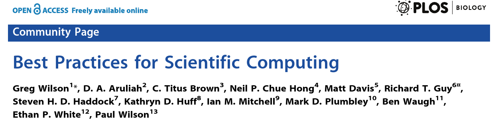

# Disclaimer  

##  

This is a condensed report based on:

Wilson G, Aruliah DA, Brown CT, Chue Hong NP, Davis M, Guy RT, et al. (2014) Best Practices for Scientific Computing. PLoS Biol 12(1): e1001745. [doi:10.1371/journal.pbio.1001745](http://journals.plos.org/plosbiology/article?id=10.1371/journal.pbio.1001745)

#  { data-background="img/apple-iphone-desk-office.jpg"}

## Software Is Lab Equipment In 21st Century { data-background="img/apple-iphone-desk-office.jpg"}

## Scientists and Software

[columns,class="row vertical-align"]

[column,class="col-xs-8"]

* scientists spent a lot of time writing software

* most scientists are self-taught

* typically unaware of what good software is

* *24 practises* in 8 sections

[/column]

[column,class="col-xs-4"]

__Good Programmers are 10x more productive than average__

[/column]

[/columns]

# Ready, Steady, Go ...

## Rule 1

__Write Programs for People, not Computers__

[columns,class="row vertical-align"]

[column,class="col-xs-8"]

* if code difficult to understand, bugs are hard to find

* hard for others as well

* including your future self

[/column]

[column,class="col-xs-4"]

](img/monkey-452864_450.jpg)

[/column]

[/columns]

## Rule 1a

__A program should not require its readers to hold more than a handful of facts in memory at once.  __

* Short-term memory can hold **7 + 2** items

* So break programs into short, readable functions, each taking only a few parameters

## Rule 1b

__Make names consistent, distinctive, and meaningful.  __

* p doesn't help the reader's short term memory as much as pressure

* Don't use temp for both "temporary" and "temperature"

* i, j are OK for indices in small scopes

## Rule 1c

__Make code style and formatting consistent.  __

*  Which rules don't matter — having rules does

*  Brain assumes all differences are significant

*  Every inconsistency slows comprehension

# Automation { data-background="img/1290px_wikimedia_1937_radio_assembly_line.jpg" }

## Rule 2

__Let the Computer Do the Work  __

](img/Titan_render.png)

**Computers exist to repeat things quickly**

## Rule 2a

__Make the computer repeat tasks  __

* Write little programs for everything

* Even if they're called scripts, macros, or aliases

* Easier to do this with text-based programming systems than with GUIs

## Rule 2b

__Save recent commands in a file for re-use.  __

* Most text-based interfaces do this automatically

    * Repeat recent operations using history

    * "Reproducibility in the small"

* Saving history supports "reproducibility in the large"

	* An accurate record of how a result was produced

    * If everything can be captured

## Rule 2c

__Use a build tool to automate workflows  __

* Originally developed for compiling programs

* Can be used whenever some files depend on others

* Makes workflow explicit

* examples: (GNU make)[https://www.gnu.org/software/make/], (snakemake)[https://bitbucket.org/johanneskoester/snakemake/wiki/Home], ... 

# Take Small Steps { data-background="img/staircase.jpg" }

## Rule 3

__Make Incremental Changes  __

* Most scientists don't have "requirements"

	* They are their own users

	* Code evolves in tandem with research

* Closest fit from industry is (agile development)[https://en.wikipedia.org/wiki/Agile_software_development]

## Rule 3a

__Work in small steps with frequent feedback and course correction.  __

* People can concentrate for 45-90 minutes without a break

* So size each burst of work to fit that

* Longer cycle should be a week or two

## Rule 3b

__Use a version control system.  __

* Tracks changes

* Allows them to be undone

* Supports independent parallel development

* Essential for collaboration collaboration

## Rule 3c

__Put everything that has been created manually in version control  __

* Not just software: papers, raw images, ...  
	* Not gigabytes...  
	* ...but metadata about those gigabytes  
	
* Leave out things generated by the computer  
	* Use build tools to reproduce those instead  
	* Unless they take a very long time to create  

# Learn From Errors { data-background="img/Windows_Blue_Screen_on_room_full_of_computers.JPG" }

## Rule 4

__Don't Repeat Yourself (or Others)  __

* Anything repeated in two or more places will eventually be wrong in at least one

* If it's faster to re-create than to discover or understand, fix it

## Rule 4a

__Every piece of data must have a single authoritative representation in the system.  __

* Define constants exactly once

* Ditto file formats, geographical locations, ...

## Rule 4b

__Modularize code rather than copying and pasting.  __

* Reducing code cloning reduces error rates
* Cuts the amount of testing needed
* And increases comprehension

## Rule 4c

__Re-use code instead of rewriting it.  __

* It takes experts years to build high-quality numerical or statistical software
* Your time is better spent doing science on top of that

# Mistakes happen { data-background="img/shit_happens.jpg" }

## Rule 5

__Plan for Mistakes  __

* No single practice catches everything
* So practice defense in depth

__Note: improving quality increases productivity__

## Rule 5 extras

* *Rule 5a*: add assertions to programs to check their operation.

* *Rule 5b*: Use an off-the-shelf unit testing library
    * Manages setup, execution, and reporting
	* Re-run unit tests after every change to the code to check for regression

## Testing Is Hard

* "If I knew what the right answer was, I'd have published by now."
* Compare to experimental data
* Or to analytic solutions of simple problems
* Or to old (trusted) programs
* If nothing else, forces scientists to document what "errors" are acceptable

## Rule 5c

__Turn bugs into test cases.  __

* Write a test that fails when the bug is present
* Then work on the code until that test passes...
* ...and no others are failing

## Test-Driven Development

* Why wait? Always write the tests, then the code
* Improves focus
* Encourages writing testable code
* And ensures tests actually get written...
* "Red, green, refactor"

## Rule 5d

__Use a symbolic debugger.  __

* Explore the program as it runs
* Better than print statements
* You don't have to re-run...
* ...or guess in advance what you'll need to know
* Use breakpoints to stop program at particular points or when particular things are true

# Get Proof { data-background="img/laser_experiment.jpg" }

## Rule 6

__Optimize Software Only After It Works Correctly  __

* Even experts find it hard to predict performance bottlenecks
* Small changes to code often have dramatic impact on performance
* So get it right, then make it fast

## Rule 6 extras

* *Rule 6a*: Use a profiler to identify bottlenecks.

	* Reports how much time is spent on each line of code
	* Re-check on new computers or when switching libraries
	* Summarize across unit tests

. . . 

* *Rule 6b*: Write code in the highest-level language possible.

	* People write the same number of lines of code per hour regardless of language
	* So use the most expressive language available to get the "right" version...
	* ...then rewrite core pieces (possibly in a lower-level language) to get the "fast" version

# Document { data-background="img/dark_and_books.jpg" }

## Rule 7

__Document Design and Purpose, not Mechanics  __

* Goal is to make the next person's life easier

* Focus on things the code doesn't say
	* Or doesn't say clearly
	* E.g., file formats
	
* An example is worth a thousand words...

## Rule 7 extras { style="line-height: 1.7;" }

* *Rule 7a*: Document interfaces and reasons, not implementations.

. . . 

* *Rule 7b*: Refactor code in preference to explaining how it works.

. . . 

* *Rule 7c*: Embed the documentation for a piece of software in that software.

# Work as a Team { data-background="img/EDBF_European_Dragon_Boat_Championships_1996_in_Silkeborg,_Swedish_Mixed_Team_500m.jpg" }

## Rule 8 { style="line-height: 1.7;" }

__Collaborate  __

* Computers were invented to calculate
* The web was invented to collaborate
* Science is more fun when it's shared

## Rule 8 extras { style="line-height: 1.7;" }

a. Use pre-merge code reviews
a. Use pair programming when bringing someone new up to speed and when tackling particularly tricky problems.
a. Use an issue tracking tool.

# Summary

##  { style="line-height: 1.7;font-size: 1.5em;" }

__One step at a time.   __

1. Use text-based interfaces
2. Turn history into scripts
3. Put everything in version control
4. Use test-driven development

