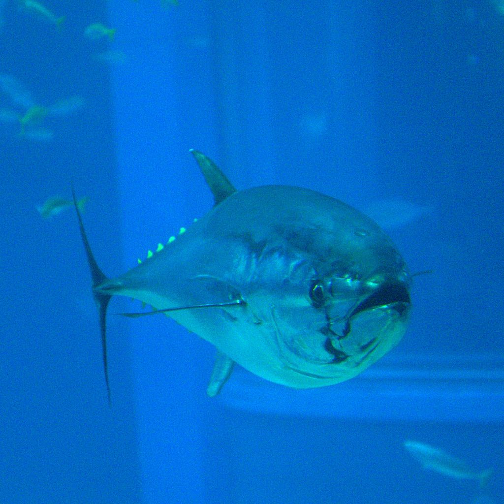
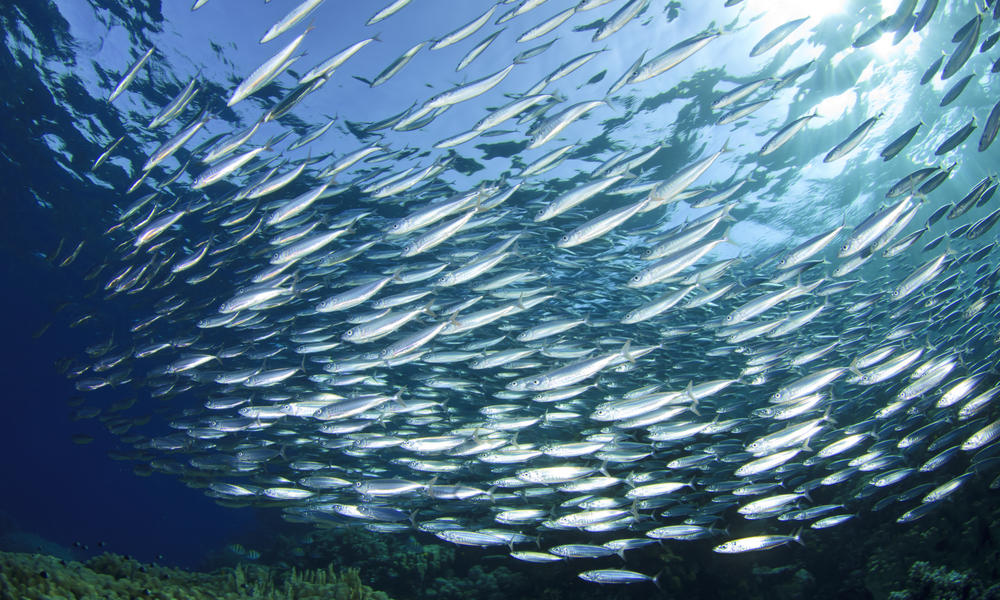
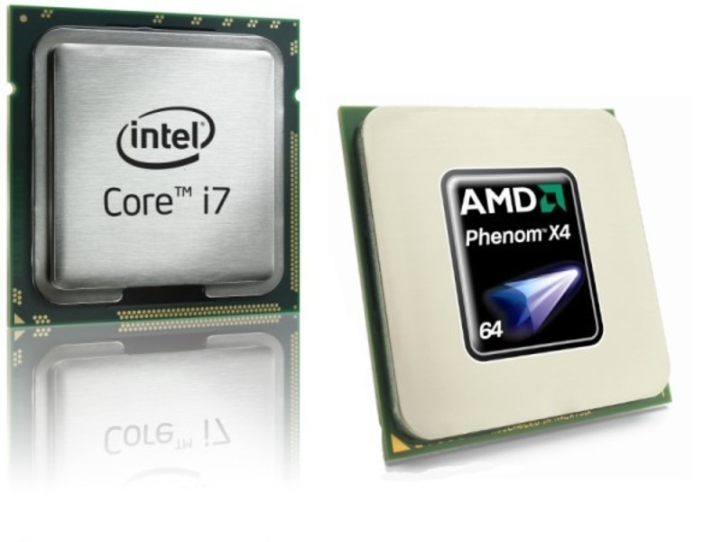
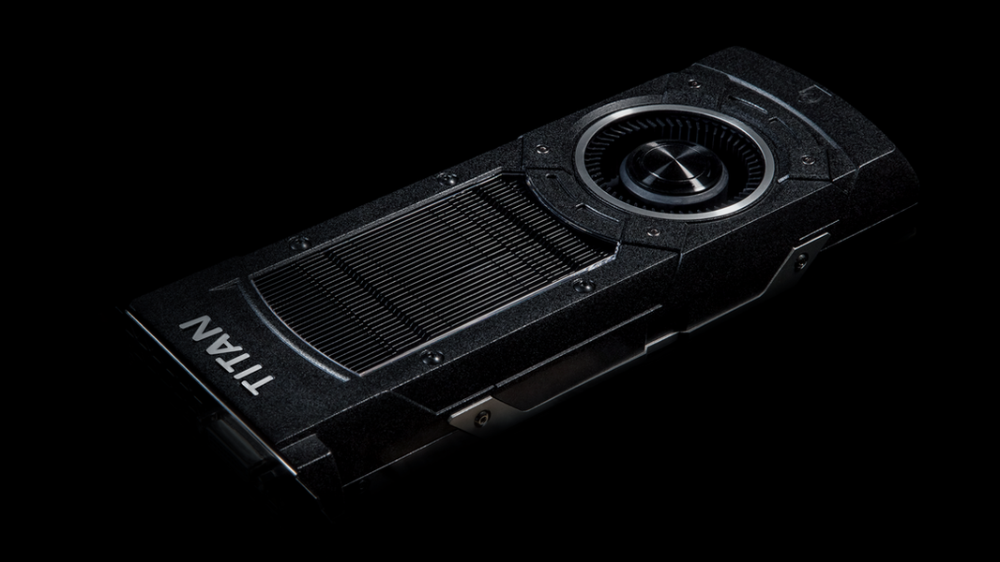
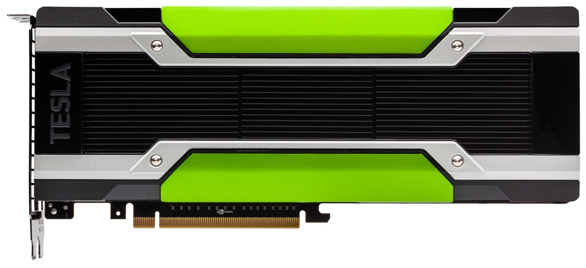

# Disclaimer(s)

## No OpenGL/Vulkan here!

[columns,class="row vertical-align"]

[column,class="col-xs-6"]

[/column]

[column,class="col-xs-6"]

[/column]

[/columns]

&copy; [Khronos Group](https://www.khronos.org/news/logos/)

## This is Open-Source!

Feel free to reply, discuss, inform, correct, ...   

[github.com/psteinb/meetingcpp2015](https://github.com/psteinb/meetingcpp2015)

If not stated otherwise, the slides and all it's code is licensed under

__Creative Commons Attribution 4.0 International License__ ([CC-BY 4.0](http://creativecommons.org/licenses/by/4.0/))

## Outline

1. Massively Parallel Programming

2. Look and Feel

3. GPGPU Landscape

4. Outlook

# Massively Parallel Programming

## Why all the fuzz??

  
Data obtained from [Top500.org](www.Top500.org)

## Food Hunt

[columns,class="row vertical-align"]

[column,class="col-xs-6"]

<!-- https://commons.wikimedia.org/wiki/File:Thunnus_orientalis_(Osaka_Kaiyukan_Aquarium).jpg -->

Tuna  
  
(fast, single, versatile)

[/column]

. . .

[column,class="col-xs-6"]

<!-- TODO -->

Forage Fish  

(small, many, use wakefield of neighbor)

[/column]

[/columns]

## The same principle on die

[columns,class="row vertical-align"]

[column,class="col-xs-6"]

<!-- TODO -->

CPU  

[/column]

[column,class="col-xs-6"]

<!-- TODO -->

GPU  

[/column]

[/columns]

## Vendor Options

<!-- TODO: image origins -->
[columns,class="row vertical-align"]

[column,class="col-xs-4"]

Nvidia Tesla  

GPU without Graphics

[/column]

[column,class="col-xs-4"]

AMD FirePro  

GPU without Graphics

[/column]

[column,class="col-xs-4"]

Intel MIC  

Not Covered Today!

[/column]

[/columns]

<!-- http://www.theregister.co.uk/2012/05/18/inside_nvidia_kepler2_gk110_gpu_tesla/ -->
# Architecture { data-background="img/nvidia_kepler_die_shot.jpg"} 

## { data-background="img/1200x_islay_overbright.png" data-background-size="1200px" }

## { data-background="img/1200x_islay_overbright_annotated.png" data-background-size="1200px" }

## For simplicity ... 

<!-- http://www.techpowerup.com/img/14-11-17/58a.jpg -->

Nvidia Kepler based
(dominant GPU architecture in HPC installations)

## A more in-depth look

# Summary

## Image References

# Backup
