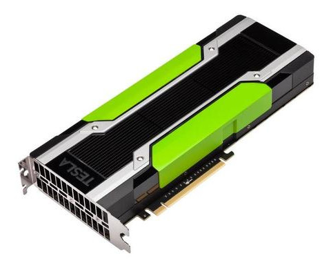

# Disclaimer(s)


## No OpenGL/Vulkan here!

[columns,class="row vertical-align"]

[column,class="col-xs-6"]


[/column]

[column,class="col-xs-6"]


[/column]

[/columns]

<center>
&copy; [Khronos Group](https://www.khronos.org/news/logos/)
</center>

## This is Open-Source!

<center>
Feel free to reply, discuss, inform, correct, ...   

**[github.com/psteinb/meetingcpp2015](https://github.com/psteinb/meetingcpp2015)**
</center>

. . .  

<center>
If not stated otherwise, the slides and all it's code is licensed under

__Creative Commons Attribution 4.0 International License__ ([CC-BY 4.0](http://creativecommons.org/licenses/by/4.0/))
</center>


## Outline

<center>
1. Massively Parallel Programming

2. Architecture

3. What can you use today

4. What can you use tomorrow
</center>


# Massively Parallel Programming

## Why all the fuzz??

<center>
  
Data obtained from [Top500.org](www.Top500.org)
</center>

## Food Hunt

[columns,class="row vertical-align"]

[column,class="col-xs-6"]

<!-- https://commons.wikimedia.org/wiki/File:Thunnus_orientalis_(Osaka_Kaiyukan_Aquarium).jpg -->
<center>
Tuna  
  
(fast, single, versatile)
</center>

[/column]

. . .

[column,class="col-xs-6"]

<!-- TODO -->
<center>
Forage Fish  

(small, many, use wakefield of neighbor)
</center>

[/column]

[/columns]


## The same principle on die

[columns,class="row vertical-align"]

[column,class="col-xs-6"]

<!-- TODO -->
<center>
CPU  

</center>

[/column]

[column,class="col-xs-6"]

<!-- TODO -->
<center>
GPU  

</center>

[/column]

[/columns]


## Vendor Options

<!-- TODO: image origins -->
[columns,class="row vertical-align"]

[column,class="col-xs-4"]

<center>
Nvidia Tesla  


GPU without Graphics
</center>

[/column]

[column,class="col-xs-4"]

<center>
AMD FirePro  


GPU without Graphics
</center>

[/column]

[column,class="col-xs-4"]

<center>
Intel MIC  


Not Covered Today!
</center>

[/column]

[/columns]


## Vendor flag ships

<!-- TODO: image origins -->
[columns,class="row vertical-align"]

[column,class="col-xs-4"]

<center>
_Nvidia Tesla K80_ 

</center>

[/column]

[column,class="col-xs-4"]

<center>
_AMD FirePro S9170_

</center>

[/column]

[column,class="col-xs-4"]

<center>
Intel Xeon Phi 5110P

</center>

[/column]

[/columns]


[columns,class="row vertical-align"]

[column,class="col-xs-4"]

* 2x GK210 chipsets
* 2x 12 GB GDDR5 RAM
* 2x 288 GB/s to RAM
* 8.7 TFlops SP
* 2.9 TFlops DP

[/column]

[column,class="col-xs-4"]

* 1x Grenada XT
* 32 GB GDDR5 RAM
* 320 GB/s to RAM
* 5.2 TFlops SP
* 2.6 TFlops DP

[/column]

[column,class="col-xs-4"]

* 62x x86 CPUs
* 8 GB GDDR5 RAM
* 320 GB/s to RAM
* 2.1 TFlops SP
* 1.1 TFlops DP

[/column]

[/columns]

<!-- http://www.theregister.co.uk/2012/05/18/inside_nvidia_kepler2_gk110_gpu_tesla/ -->
# Architecture { data-background="img/nvidia_kepler_die_shot.jpg"} 


## { data-background="img/1200x_islay_overbright.png" data-background-size="1200px" }


## { data-background="img/1200x_islay_overbright_annotated.png" data-background-size="1200px" }


## For simplicity ... 

<center>


All illustrations based on Nvidia Kepler Architecture  
(dominant GPU architecture in HPC installations)
</center>


## A more in-depth look

<div style="text-align: center;margin-top: 4%;">
<object type="image/svg+xml" data="figures/K40.svg"
width="1400" border="0" style="background-color: #FFFFFF;">
</object>
</div>

<center>
Nvidia K40: 15 Streaming Multiprocessors (SMX), 12 GB of GDDR5 DRAM
</center>

## Kepler SMX Close-up

<div style="text-align: center;margin-top: 4%;">
<object type="image/svg+xml" data="figures/GK210_sm.svg"
width="1600" border="0" style="background-color: #FFFFFF;">
</object>
</div>

<center>
CUDA core: 1 fp32 ops / clock <!-- (1/3 fp64 ops / clock) -->
</center>


## SIMT Execution

[columns,class="row vertical-align"]

[column,class="col-xs-2"]

**Warp**

[/column]


[column,class="col-xs-4"]


<object type="image/svg+xml" data="figures/thread.svg"
height="200" border="0">
</object>


[/column]

[column,class="col-xs-8"]

* smallest unit of concurrency: *32 threads*
* thread = single CUDA core
* all threads execute same program

[/column]

[/columns]

. . .  

[columns,class="row vertical-align"]

[column,class="col-xs-2"]

**Block**

[/column]


[column,class="col-xs-4"]


<object type="image/svg+xml" data="figures/thread_block.svg"
height="200" border="0" >
</object>


[/column]

[column,class="col-xs-8"]

* can synchronize (barriers)
* can exchange data (common "shared" memory, etc.)

[/column]

[/columns]


. . .  

[columns,class="row vertical-align"]

[column,class="col-xs-2"]

**Grid**

[/column]


[column,class="col-xs-4"]


<object type="image/svg+xml" data="figures/grid_block.svg"
height="200" border="0" >
</object>


[/column]

[column,class="col-xs-8"]

* grids/blocks serve as work distribution/sharing mechanism on device (occupancy)

[/column]

[/columns]


## Hiding Memory Latency

* grid blocks dispatched to SMX based warp schedulers  

. . .

[columns,class="row vertical-align"]

[column,class="col-xs-12"]

<center>
<object type="image/svg+xml" data="figures/high_throughput_smx.svg"
width="1400" border="0" >
</object>
</center>

[/column]

[/columns]

* hide (memory) latency by interleaving active warps


## Best Practises: Data Locality

<center>
[columns,class="row vertical-align"]

[column,class="col-xs-12"]

<object type="image/svg+xml" data="figures/gpu_cpu_dichotomy.svg"
width="1400" border="0" >
</object>


[/column]

[/columns]

**Keep data put as long as possible!**

</center>

## Best Practises: Memory Access

<center>
**Good: Coalesced Memory Access**

[columns,class="row vertical-align"]

[column,class="col-xs-12"]

<object type="image/svg+xml" data="figures/coalesced_mem_access.svg"
width="1000" border="0" >
</object>


[/column]

[/columns]

</center>


. . .

<center>

**Bad: Non-Coalesced Memory Access**

[columns,class="row vertical-align"]

[column,class="col-xs-12"]

<object type="image/svg+xml" data="figures/non_coalesced_mem_access.svg"
width="1000" border="0" >
</object>

* every thread accesses different cache line at random
* warp has to be replayed 31 times to complete 1 instruction

[/column]

[/columns]

</center>


## Summary Architecture

<center>
* **GPUs are complicated beasts**

* **massive parallel compute power** 

* **massive ways to kill performance**
</center>

# What can you use today?

## A Word of Warning!

[columns,class="row vertical-align"]

[column,class="col-xs-6"]

<!-- https://pixabay.com/p-42657/?no_redirect -->


[/column]

[column,class="col-xs-6"]

<center>
**Never ever program GPGPUs!**  
</center>

. . .


* 32 threads is the minimum you get

* good tools are rare and almost never portable

. . .

<center>
**Use a Library!**

</center>

[/column]

[/columns]


## Vendor Libraries

<center>

[columns,class="row vertical-align"]

[column,class="col-xs-6"]

[**CUDA**](https://developer.nvidia.com/gpu-accelerated-libraries)

[/column]


[column,class="col-xs-6"]

[**OpenCL**](http://developer.amd.com/tools-and-sdks/opencl-zone/acl-amd-compute-libraries/)

[/column]

[/columns]


[columns,class="row vertical-align"]

[column,class="col-xs-6"]

* cuBLAS
* cuFFT
* cuDNN
* cuSparse
* cuSolver
* cuRAND  
...

[/column]

[column,class="col-xs-6"]

* clBLAS
* clFFT
* clSparse
* clRNG  
...

[/column]

[/columns]

</center>

## Domain Libraries


<center>

* Linear Algrebra: [VexCL](https://github.com/ddemidov/vexcl), [ViennaCL](http://viennacl.sourceforge.net/), ...

* Image/Video Processing: [OpenCV](http://opencv.org/), [Ffmpeg](http://ffmpeg.org/), ...

* Machine Learning: [Caffe](http://caffe.berkeleyvision.org/), [Torch](http://torch.ch/), ...

* Bioinformatics: [SeqAn](http://www.seqan.de/), [nvbio](https://github.com/NVlabs/nvbio), ... 

</center>

. . .

<center>

**Any scientific field near you!**

</center>

## CUDA Overview


## CUDA Hello World

<center>

**Vector Sum**  

1. Declare and allocate host and device memory.
1. Initialize host data.
1. Transfer data from the host to the device.
1. Execute one or more kernels.
1. Transfer results from the device to the host.
</center>

. . .

<center>
**Easy!**
</center>


## CUDA Hello World

```
int main(void)
{
  int N = 1<<20;
  float *x, *y, *d_x, *d_y;
  x = (float*)malloc(N*sizeof(float));
  y = (float*)malloc(N*sizeof(float));

  cudaMalloc(&d_x, N*sizeof(float)); 
  cudaMalloc(&d_y, N*sizeof(float));

  for (int i = 0; i < N; i++) {
    x[i] = 1.0f;
    y[i] = 2.0f;
  }

  cudaMemcpy(d_x, x, N*sizeof(float),
	         cudaMemcpyHostToDevice);
  cudaMemcpy(d_y, y, N*sizeof(float),
	         cudaMemcpyHostToDevice);

  // Perform SAXPY on 1M elements
  saxpy<<<(N+255)/256, 256>>>(N, 2.0f, d_x, d_y);

  cudaMemcpy(y, d_y, N*sizeof(float),
		     cudaMemcpyDeviceToHost);

  float maxError = 0.0f;
  for (int i = 0; i < N; i++)
    maxError = max(maxError, abs(y[i]-4.0f));
  printf("Max error: %fn", maxError);
}

//

__global__
void saxpy(int n, float a, float *x, float *y)
{
  int i = blockIdx.x*blockDim.x + threadIdx.x;
  if (i < n) y[i] = a*x[i] + y[i];
}
```


## OpenCL

## thrust

## C++AMP and HC

## Pragma Mafia

# What can you use tomorrow

## Boost.Compute

## Sycle and Spear

## C++17


# Summary

## Image References


# Backup
